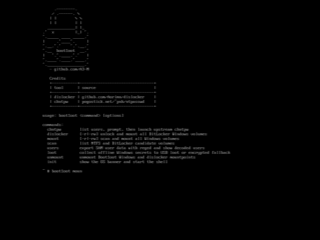
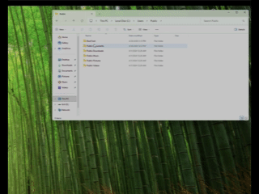

# boot1oot

Boot1oot is a small RAM-only Linux live environment for offline Windows
filesystem audit work. It can scan NTFS and BitLocker volumes, mount Windows
filesystems read-only or read-write, collect selected offline artifacts, and
unmount cleanly before returning to Windows.

Recommended: [download the latest release](https://github.com/A3-N/boot1oot/releases/latest)

Manual compile instructions: [SETUP.md](SETUP.md)

USB and VM boot instructions: [ISO.md](ISO.md)

## CLI Preview

```text
     .--------.
    / .------. \
   | |        \ \
   | |        | |
  ____________| |_
.'  x         |_| '.
'._____ ____ _____.'
|     .'____'.     |
'.__.'.'    '.'.__.'
'.__  boot1oot  __.'
|   '.'.____.'.'   |
'.____'.____.'____.'
'.________________.'

usage: boot1oot <command> [options]

commands:
  chntpw    list users, prompt, then launch upstream chntpw
  dislocker [-r|-rw] unlock and mount all BitLocker Windows volumes
  mount     -r|-rw scan and mount all Windows volumes
  scan      list NTFS and BitLocker candidate volumes
  users     export SAM user data with reged and show decoded users
  loot      collect offline Windows secrets to USB loot or encrypted fallback
  unmount   unmount Boot1oot Windows and dislocker mountpoints
```


## Artifacts

- `boot1oot.iso`: BIOS/UEFI ISO for virtual CD/DVD boot.
- `boot1oot.img`: BIOS/UEFI raw USB image with a writable `B1OOT_LOOT`
  partition.

Use the ISO for VMs. Use the IMG for physical USB media when you want persistent
loot storage on the USB device.

## Commands

```text
boot1oot scan          list NTFS and BitLocker candidate volumes
boot1oot mount -r      mount detected Windows volumes read-only
boot1oot mount -rw     mount detected Windows volumes read-write
boot1oot dislocker -r  unlock and mount BitLocker volumes read-only
boot1oot loot          collect offline artifacts to USB loot or fallback archive
boot1oot users         export and show local SAM users
boot1oot chntpw        launch interactive chntpw for a selected user
boot1oot unmount       unmount Boot1oot-managed mountpoints
```

`boot1oot mount` requires either `-r` or `-rw`.

## Typical Flow

```sh
boot1oot scan
boot1oot mount -r
boot1oot loot
cd /
boot1oot unmount
poweroff
```

For write-capable workflows:

```sh
boot1oot mount -rw
```

Mounted Windows volumes appear under:

```text
/mnt/windows/<device>
```

Examples:

```text
/mnt/windows/sda3
/mnt/windows/nvme0n1p3
```



## Loot Output

USB image boots write loot to the FAT partition labeled `B1OOT_LOOT`:

```text
/loot/<collection-id>
```

ISO boots usually do not have writable USB loot storage. In that case Boot1oot
creates an encrypted fallback archive under:

```text
C:\Users\Public\Boot1oot
```

Set `BOOT1OOT_LOOT_PASSPHRASE` before running `boot1oot loot` to choose the
fallback archive passphrase. If unset, the fallback passphrase is `boot1oot`.

The collected artifact list and offline extraction notes are in
[ISO.md](ISO.md#collected-artifacts).

An offline helper is included for retrieved loot:

```sh
python3 scripts/boot1oot-extract.py /path/to/boot1oot-loot-<time>-<pid>
```



## Included Tools

- `boot1oot`
- `dislocker-fuse`
- `dislocker-metadata`
- `ntfs-3g`
- `chntpw`
- `reged`
- `samusrgrp`
- `sampasswd`
- `openssl`
- BusyBox and bash

Build instructions are in [SETUP.md](SETUP.md). USB and VM boot instructions
are in [ISO.md](ISO.md).
